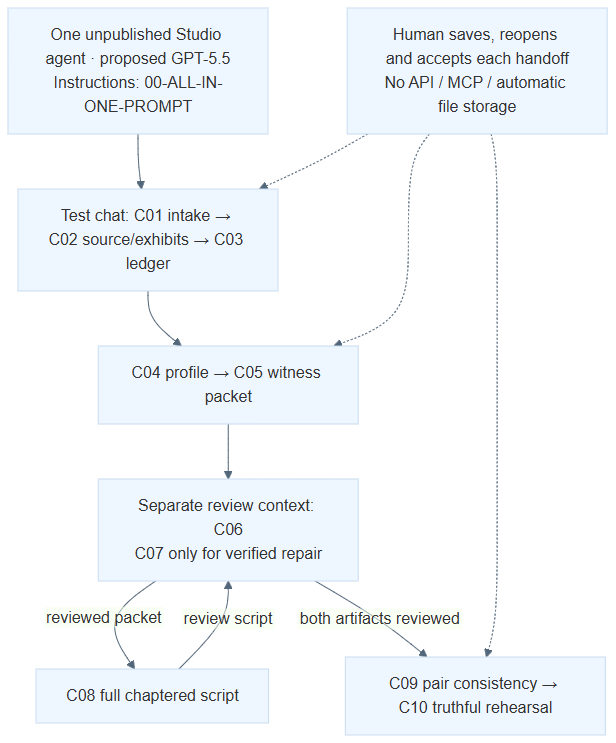

# Workflow wiring

[Open the PNG preview](D00-MANUAL-WIRING.png) · [SVG backup](D00-MANUAL-WIRING.svg) · [Mermaid source](D00-MANUAL-WIRING.mmd) · [Visio drawing](Albert-No-MCP-or-API-Visio.vdx)

The Visio file is an editable Visio XML Drawing (.vdx), with separate node, connector and label shapes. Its XML and connector references were checked. Desktop Visio is unavailable on the build machine, so native opening and editing remain unverified. Use the PNG or SVG backup immediately; use the Mermaid source when updating the workflow. The export receipt records the source SVG fingerprint.

Models shown are proposed pilot settings from user-reported labels, not verified tenant selections. Exact prompt placement and configuration boundaries are in [Start here](../START-HERE.md).

When wiring or prompt-role placement changes, update the Mermaid source and regenerate SVG, PNG and Visio together; check the diagram against the prompt placement table before sharing. Diagram validation does not prove tenant execution or output quality.
