> Presentation copy: see [naming revision](NAMING-NOTE.md).

# Albert: Innovation prompt-only starter

**1.0 · setup and improvement kit · local candidate.** This is ready to use as a documented prototype and test harness. It is not gold-qualified, tenant-tested, or approved for real witness delivery. The prior study and its held outputs are preserved separately.

The result you are aiming for is a saved, source-traceable two-host transcript, a ten-anchor preparation card and timing instructions. The first exercise is deliberately short so you can learn the handoffs. A real source-rich case can target 30–40 minutes; the evidence must earn that length.

## Start with three pages

1. [Set up four small agents](01-COPILOT-SETUP.md). Paste one role file into each agent's Instructions. Keep them unpublished. You act as coordinator and move the saved packets.
2. [Run the first synthetic case](02-FIRST-RUN.md). It supplies the source, operator authority, exact prompts and save names. Complete the short example before trying a full case.
3. [Run your own improvement cycle](04-IMPROVEMENT-LAB.md). Save a baseline, diagnose one cause, test one change and keep the previous version if the edit makes it worse.

Caption: Albert's stage composition adapts DAD learning/reviewer patterns and the documented Meta NotebookLlama staging influence. Mermaid supplies notation/rendering. Exact credits: [CREDITS](CREDITS.md). This figure is a generated projection of workflow.json, not a copied third-party diagram.

## What you need

Copilot Studio maker access in your organization's approved environment, permission to use the selected model and synthetic inputs, and an ordinary approved folder/text editor for saving Markdown. Microsoft service entitlement/capacity still applies. You do not need your own API key, MCP server, custom connector, flow, database, SharePoint library or code runner for the default process.

The four roles are Analyst, Writer, Evidence Reviewer and Conversation Reviewer. These are saved role agents with human-mediated handoffs. A different agent/chat reduces shared conversation exposure; it does not prove different model families or statistical independence. [Native child-agent wiring](06-OPTIONAL-CHILD-AGENTS.md) is optional after the manual baseline works.

## Where the useful pieces live

| Folder/file | Use |
|---|---|
| roles/ | Short permanent instructions for the four Studio agents |
| prompts/ | Complete stage prompts, including the required inherited instructions |
| paste/ | Smaller ordered LOAD parts when a full stage prompt is rejected by the UI |
| templates/ | Case graph, role packet, saved-state manifest and improvement record |
| [Saved demo and review](demo/00-READ-THIS-EXAMPLE.md) | New synthetic source, held example and acceptance exercises; no private case files |
| [Graph/state guide](03-GRAPH-AND-STATE.md) | Typed nodes/edges, source trace, conflicts, permissions, queries and invalidation |
| [Limitations and next steps](05-LIMITATIONS-AND-ROADMAP.md) | Actual shortcomings and a proposed evidence-based improvement path |
| [Placement table](07-PROMPT-PLACEMENT.md) | Every RUN stage, exact role, inputs, outputs and inherited P/A/W IDs |
| reference/ | Byte-identical prompt/process imports and donor/reference records |
| checks/ | Optional maintainer validation; not an MVP setup dependency |
| [QA](QA.md) | What was tested locally and what still needs your tenant |

## First acceptance decision

Success is that you can save/reopen the case state, trace every script claim to its permitted source, obtain separate complete evidence/craft reports, and make a visible accept/repair/hold decision. A held candidate is a useful harness result. Do not repeat generations until one reports a pass.

Use [the configuration worksheet](templates/CONFIGURATION.md) to record your actual model labels and environment. No model availability is assumed. Start with manual_revision identity: you compare exact saved revisions; the model does not invent hashes. This is a disclosed manual adapter, not the older process's hash-verified acceptance claim.
