# A real graph model, kept in ordinary files

The MVP serializes a typed case graph as Markdown tables. IDs, edge meanings, provenance paths, grants and invalidation rules are real engineering contracts. The operator and prompt roles execute them manually; this is not an automatic database engine or access-control system. The optional checker can validate structural examples, but is not needed to run prompts.

Keep the generic prompt/lesson asset graph separate from the case graph. No case rows belong in the reusable asset catalog. Start with [GRAPH template](templates/GRAPH.md), [state manifest](templates/STATE.md), and the [synthetic source](demo/SOURCE.md).

## Identities and types

IDs are case-scoped and never reused for a different object. A snapshot has CASE, WITNESS, REV and audience/use. Each row records its own revision; the snapshot freezes its included rows. In manual_revision mode, hashes are not_computed and the operator records saved/reopened exact text. In hash_verified mode use actual computed hashes, never a model guess.

| Table/type | Required fields | Meaning |
|---|---|---|
| SOURCE S01 | title, source file, revision, authority, digest_status | Original evidence/document; authority is recorded, not conferred |
| SPAN SP01 | source_id, start_anchor, end_anchor, exact text or provided excerpt, item_id | Exactly one parent SOURCE; keep negation/qualifiers with the cited words |
| ITEM EX01 | source/span IDs, displayed label, semantic type, provenance | Distinct exhibit, attachment, schedule or analogous item; never merge EX01/EX02 by similar labels |
| CLAIM CL01 | attributed proposition, speaker/source actor, lane, event_time, learned_time, source_span_ids | An assertion with qualification; an account is not established truth |
| GRANT PG01 | owner basis, witness, unit, target IDs, use, effective_time, approved/proposed | Proposition or explicit span scope; no permission inferred from availability |
| CONFLICT CF01 | question, side_a_claim, side_b_claim, qualification, unresolved status | Two distinct attributed endpoints; no truth winner or deception label |
| ARTIFACT AR01 | file, revision, kind, audience, dependency IDs, complete flag | Saved plan/script/card/map/T06/review/decision, not chat memory |
| EDGE E01 | from_id, relation, to_id, snapshot_rev | Typed relationship; both endpoints must exist in that snapshot |

Lanes: witness_observed, witness_later_learned, attributed_disputed, author_only, unknown, method. A claim's lane describes its epistemic status. A grant separately controls permitted use: personal_testimony, attributed_discussion or method_practice. A document or later account can be discussed without being asserted as personal observation. Method claims need an approved method source/basis; never invent a rule of law.

## Allowed edges and invariants

| Relation | From → to | Rule |
|---|---|---|
| CONTAINS | SOURCE → SPAN | Each SPAN has exactly one parent; anchors belong to that source |
| IDENTIFIES_ITEM | SPAN → ITEM | Preserve the item's distinct label and limits |
| ATTRIBUTES | SPAN → CLAIM | Source supports that qualified attribution, not a truth verdict |
| HAS_SIDE_A / HAS_SIDE_B | CONFLICT → CLAIM | Exactly one each, distinct claims; both require raw evidence |
| PERMITS | GRANT → CLAIM or SPAN | Target type matches the approved permission unit |
| USES | ARTIFACT → CLAIM/SPAN/GRANT/CONFLICT/ITEM | Every factual use has a complete source and permission path |
| DERIVES_FROM | ARTIFACT → ARTIFACT | Dependency graph is acyclic; no dangling revisions |
| ASSESSES | review/decision ARTIFACT → ARTIFACT | Exact current input revision, full-read status and matching audience/use |

A SPAN grant permits supported meaning within that actual span, not unrelated inferences. A proposition grant does not expand to the rest of its paragraph. Do not silently narrow a real span grant to a summary either. A conflict discussion requires permission for both disclosed sides; merely linking CF01 cannot smuggle an excluded side into speech. Unknown, unavailable, excluded and unused are different states.

## Four manual query contracts

Ask the Analyst to return query, snapshot, result IDs, reverse source path, grant/use check, missing/truncated data and COMPLETE/PARTIAL/HOLD. Default cap is 12 claims per packet; split and number packets with a manifest rather than dropping overflow.

1. TRACE(CL01): claim → ATTRIBUTES span → CONTAINS source, plus item identity, qualification, time and any conflict endpoints. Return the actual supplied source passage.
2. VIEW(witness, use, practice_time): only owner-approved permitted propositions and explicitly allowed attributions/methods. Keep later learning separate from event-time memory. Author-only facts/metadata stay out of the learner packet. An excluded endpoint means no whole-conflict export unless its disclosure is separately allowed.
3. REVIEW_BUNDLE(assembly): complete script, claims, KC card, as-built T06, plan, source/view and current input identities. Craft may receive a permitted projection; Evidence must receive enough authorized raw evidence to assess every included premise. Missing access means NOT_ASSESSED.
4. IMPACT(changed_id): reverse USES/DERIVES_FROM/ASSESSES traversal identifies affected plans, chapters, cards, timing and reviews. Mark them stale; the operator verifies the dependency closure. A prompt cannot guarantee a complete traversal.

## Save, reopen, change

Save the state manifest and each output as CASE-WITNESS-KIND-REV.md in an ordinary authorized folder. Reopen the actual file, compare its full text/required IDs, and record who checked it. Copy only the listed current files into a new role's chat. A reference to a local path does not give that agent access.

Source/grant changes produce a new snapshot. Script edits produce a new assembly revision and invalidate its claim-map/card/T06/timing reviews until the complete new assembly is checked. Keep old files and record supersedes/invalidated_by; never overwrite a held result to make a history look clean. An unchanged source can remain at its own old revision if the new manifest explicitly binds it.

For richer author research, the Analyst may read all authorized sources; it passes only the owner-reviewed permitted view to the Writer. If restricted material is accidentally pasted into a role intended to be clean, record exposure and start a new appropriately scoped conversation. Prompt instructions cannot erase prior exposure or enforce file permissions.

## Upgrade without rebuilding the reasoning

Full manual can put these same rows and file IDs into an approved shared folder/SharePoint library with explicit access and versioning. Connected adapters can map source/span/claim/grant/conflict/artifact IDs to service records, implement the four queries and enforce permissions/transactions. That adapter and its tests still need implementation; this starter is not an importable database or a working case backend. The P/A/W roles and claim/source semantics remain reusable.

Caption: Albert case-specific graph contract; DAD informs explicit identities, typed relationships and source traceability. Mermaid notation. No DAD private graph or third-party case data is copied. See [credits](CREDITS.md).
