# Optional native child agents, after the manual baseline

The four-agent manual route is the supported starting procedure in this kit. Copilot Studio standard harness also documents native child agents: main agent **Agents → Add → New child agent**, then name, usage description, instructions, optional knowledge/tools, Enabled and Save. Start disabled while configuring. [Microsoft child-agent setup](https://learn.microsoft.com/en-us/microsoft-copilot-studio/add-agent-child-agent).

**Children always receive the parent's context.** An input called `permitted_view` does not remove other conversation material. Child review is therefore a shared-context check; keep the separate standalone Evidence and Conversation agents for the independent review attempts in this MVP. Do not assume a separate child model selector. [Microsoft context guidance](https://learn.microsoft.com/en-us/microsoft-copilot-studio/guidance/multi-agent-patterns).

## A small useful first child

Add a **Source Trace Helper** inside **Albert Case Analyst** for a single authorized internal task. This keeps parent and child in the same analyst disclosure scope. Use the instruction block below; it retrieves no external data and has no tools. Do not connect it to a witness-facing parent that contains a different disclosure scope.

Usage description: “For a supplied authorized graph and source packet, trace one named claim or inspect one pair of conflicting claims. Return a complete bounded evidence packet; do not draft testimony.”

```text
You are the Source Trace Helper within Albert Case Analyst.
Use only the explicitly assigned analyst source/graph packet already in context.
Your task is TRACE(claim_id) or CONFLICT(conflict_id), never a broad case answer.
Return run_id, snapshot_rev, received input IDs, exact qualified claim(s),
edge IDs, raw span text/anchors, source/item identity, permission-unit/use check,
missing/truncated fields and COMPLETE/PARTIAL/HOLD. A conflict has two attributed
sides and no truth winner. Do not infer authority from a graph edge.
Return findings only to the parent; do not answer the user directly, save files,
call tools, alter a grant/source, or draft witness answers. If context scope is
unclear, HOLD. Maximum 12 claims; list overflow and request the next packet.
```

Natural-language task input and response are sufficient for this first optional helper. If the UI offers explicit Inputs/Outputs, use text inputs `run_id`, `snapshot_rev`, `task_kind`, `target_id`, `assigned_packet_ids` and text output `trace_packet`; configure actual field mapping and test it in the tenant. These fields are a proposed adapter, not an imported configuration. Keep the complete trace in `trace_packet`; a vague summary is not the case graph.

Parent delegation example, sent only after the operator has approved the analyst packet:

```text
Use Source Trace Helper for TRACE(CL03), run LANTERN-MINA-TRACE-R01,
snapshot R01, assigned packet IDs [actual list]. Return findings only; do not
reply to the user. Preserve source qualifiers and report missing input.
```

## Tenant probe before using it

Test one supported trace, a missing claim, a wrong snapshot and a conflicting pair. Inspect the actual activity trace if available: did the intended child run, did the whole packet return, and did only the parent present it? Record the actual behavior. The operator still saves/reopens the trace; child agents do not add durable writeback.

If the agent chooses not to call the helper, returns a compressed result, uses undeclared sources, shares inappropriate context, or the tenant lacks child creation, disable this candidate helper and paste the query to the standalone Analyst. The main workflow continues unchanged. Do not describe an untested natural-language trigger as a deterministic scheduler.



Caption: Albert's manual role/context layout and optional same-scope trace child, informed by Microsoft's documented parent/child context behavior. Mermaid notation. See [credits](CREDITS.md). This diagram describes a candidate setup, not a deployed tenant.
