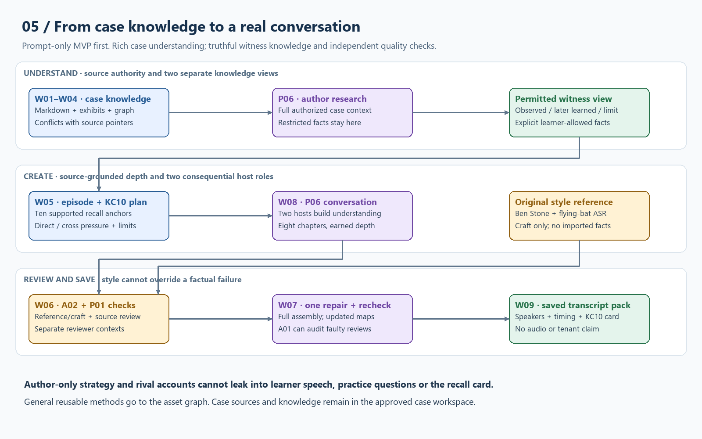

# WF05 · Case knowledge to a conversational deep dive

Portable core 0.1.0. This flow composes Albert's existing source/graph/witness preparation with P06 and A02. It preserves W-stage identities and existing source/knowledge gates. It is a candidate alternative for richer W08 output; the earlier 3.3.1 study remains frozen.

| Stage | Owner / instruction | Input → saved output |
|---|---|---|
| W01–W04 | Existing source/knowledge workflow | All authorized Markdown/exhibits → versioned source index, graph with provenance, witness knowledge view |
| W05-PODCAST | Planner / P06 | Sources + view + conflicts + supplied methods → `CASE-W05-RESEARCH-A1.md` (author-only), `CASE-W05-PERMITTED-A1.md`, `CASE-W08-PLAN-A1.md`, `CASE-KC10-A1.md` |
| W06-PLAN | Source checker / P01 | Plan + actual sources → `CASE-W06-PLAN-A1.md`; resolve material premises before drafting |
| W08 | Writer / P06 | Checked plan + permitted view + separate reference fingerprint → `CASE-W08-SCRIPT-A1.md`, `CASE-W08-CLAIMS-A1.md` |
| W06-C | Conversation reviewer / A02 | Full script + original style reference + T05 → `CASE-W06-CONVERSATION-A1.md` |
| W06-E | Independent source checker / P01 | Full script, KC card, permitted view and sources → `CASE-W06-EVIDENCE-A1.md` |
| W07 | One editor / P02 | Verified findings → A2 script/map/card and change log; preserve A1 |
| W06-FINAL | Fresh checker / P03 + A02 criteria | Exact A2 full assembly → final review; unresolved defects stay visible |
| W09 | Operator / export instructions | Reviewed script → `CASE-W09-SPEAKERS.txt`, `CASE-W09-TIMING.md`, KC card and source map; actual voice production later |
| WF04 | A01 reviewer of agents | Instructions + actual plans/drafts/reviews + outcomes → targeted candidate improvement, separate from repairing this case |

Minimum practical mesh: one planner/writer, a separate evidence reviewer, a separate conversational reviewer, one editor (may be original writer), and final independent check. These are sequential responsibilities when only one chat tool is available; a fresh chat improves context separation but does not guarantee independence. Three concurrent agents maximum by default. A01 can audit a reviewer on a trigger; no endless checker chain. Budget one candidate draft, one verified repair and one final whole-script check. Stop the affected lane for stale inputs, missing disclosure authority, material ungrounded claims, or inadequate source depth. Report remaining gaps instead of silently weakening standards.

**All-case research / witness export split:** broad sources enrich the author's understanding, but only explicitly permitted propositions reach learner speech, excerpts, recall card and practice premises. Author-only data is held in the authorized case workspace with separate access. For the prompt-only version these can be ordinary saved Markdown tables and IDs; there is no requirement for a graph database, MCP or API. Chunk/graph summaries never replace checking the original passage.

**Style reference boundary:** original podcast transcript is private style evidence. Reference-pattern notes may be passed to the writer; factual source review reads actual case files. Save only generic methods in the reusable asset graph. Do not bundle client or licensed case files into this toolkit.

**Model and product setup:** use [REVIEWER-ADAPTERS](../REVIEWER-ADAPTERS.md). The host chooses current model bindings, authorized input access and save mechanism. MCP retrieves exact prompt files; it is not a case retrieval backend or autonomous spawning service. Source/model/runtime changes invalidate affected review evidence. Keep prior prompt/script revisions and an owner-approved rollback; no auto-adoption.
