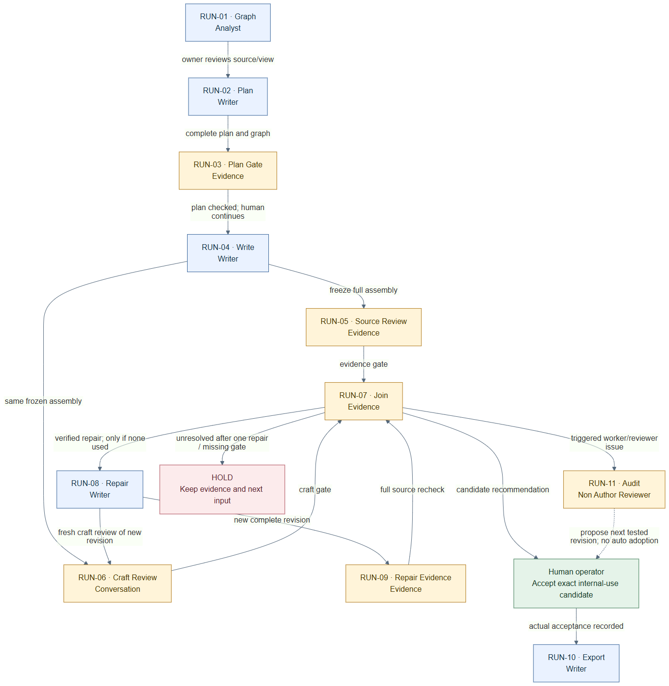

# MVP workflows

**For Visio:** open [Albert-MVP-Visio.vdx](Albert-MVP-Visio.vdx). It contains three editable pages: the run sequence, role setup, and case graph. The filename explicitly identifies the Visio version.

If Visio does not open it, use a backup below. The PNG opens as an ordinary image; the SVG scales cleanly; Mermaid is the editable text source.

| Workflow | Mermaid backup | SVG backup | PNG backup |
|---|---|---|---|
| Run sequence | [D01-WORKFLOW.mmd](D01-WORKFLOW.mmd) | [D01-WORKFLOW.svg](D01-WORKFLOW.svg) | [D01-WORKFLOW.png](D01-WORKFLOW.png) |
| Role setup | [D02-SETUP.mmd](D02-SETUP.mmd) | [D02-SETUP.svg](D02-SETUP.svg) | [D02-SETUP.png](D02-SETUP.png) |
| Case graph | [D03-GRAPH.mmd](D03-GRAPH.mmd) | [D03-GRAPH.svg](D03-GRAPH.svg) | [D03-GRAPH.png](D03-GRAPH.png) |

The Visio export uses Microsoft's documented XML Drawing format, with editable shapes, labels and connectors derived from the same diagram nodes/edges. It is a `.vdx` file, not a renamed SVG or a native `.vsdx` file. Native Visio opening has not been tested here. Microsoft documents [the XML drawing format and its relationship to VSDX](https://learn.microsoft.com/en-us/office/client-developer/visio/introduction-to-the-visio-file-formatvsdx). For web-only editing, its [format support](https://support.microsoft.com/en-us/visio/view-create-and-edit-a-diagram-in-visio-for-the-web) differs; use the backups or open/convert the file in desktop Visio.

Update the source workflow in the supporting reference package, regenerate Mermaid, then regenerate the previews and Visio export together. The export receipt under More records the exact source hashes and node/edge counts. No automatic watcher is installed.

Credits: Albert's project-specific composition uses Mermaid notation/rendering and DAD-derived review/graph patterns; see [credits](../More/MVP-Reference/CREDITS.md). This page keeps only the MVP diagrams; the full designs are under [More](../More/README.md).
